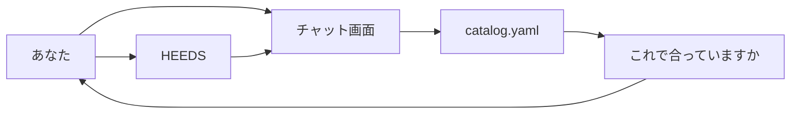

# はじめに（初学者向け）

この文書は、プログラムに慣れていない人が「何をするソフトか」を掴むための入口です。

概要は [README.md](../README.md)、インストールは [セットアップ.md](セットアップ.md)、起動は [動かし方.md](動かし方.md) です。  
`docs/` の説明書は、見る順番で `01_` から番号が付いています。  
ファイルのつながりは [02_ファイルの関連.md](02_ファイルの関連.md)、設定値の意味は [03_変数と設定.md](03_変数と設定.md) です。

## このプログラムがすること

ブラウザのチャットに「衝突安全を確認したい」などと書くと、次の順で進みます。

1. プログラムが `heeds/catalog.yaml` を読み、文の中の言葉から設計要件を決める
2. 添付された CSV の変数と、実行する試験の名前を示し、「これで合っていますか？」と聞く（ここではまだ HEEDS は動かない）
3. 「はい」などと同意すると、HEEDS|MDO に「この変数範囲で、このスタディを実行して」と依頼する
4. 結果の表やファイルがチャットに返る。文章の要約だけ、そのあと Azure OpenAI が書く

大事な点: **計算そのものは HEEDS が行います。** この Python プログラムは「チャットと HEEDS の仲立ち」です。  
どの試験を実行するかは AI が選びません。言葉と試験の対応は `catalog.yaml` だけに書いてあり、確認文もプログラムが組み立てます。

## 読む順番

最初に [README.md](../README.md)（概要）。環境を作るときは [セットアップ.md](セットアップ.md)、チャットを開くときは [動かし方.md](動かし方.md)。仕組みは `docs/` を番号順です。

| 順番 | 文書 | 内容 |
| --- | --- | --- |
| 概要 | [README.md](../README.md) | 何をするソフトか |
| — | [セットアップ.md](セットアップ.md) | インストールと `.env` |
| — | [動かし方.md](動かし方.md) | 起動と確認 |
| 01 | この文書 | 全体像と用語 |
| 02 | [02_ファイルの関連.md](02_ファイルの関連.md) | どのファイルが何をするか |
| 03 | [03_変数と設定.md](03_変数と設定.md) | `.env` やカタログの項目 |
| 04 | [04_SPEC.md](04_SPEC.md) | 仕様の詳細、会話の例、既知の限界 |
| 05 | [05_HEEDS接続.md](05_HEEDS接続.md) | HEEDS 実機のつなぎ方 |
| 06 | [06_HEEDSファイルを作るとき.md](06_HEEDSファイルを作るとき.md) | プロジェクトのファイル名・変数名・出力名 |
| 07 | [07_設定チェック.md](07_設定チェック.md) | プログラム設定と HEEDS 実名の事前チェック |
| 08 | [08_試験の種類を変える.md](08_試験の種類を変える.md) | チャットの要件や、実行する解析を増やす・変える |
| 09 | [09_起動から終了までの流れ.md](09_起動から終了までの流れ.md) | 起動から Ctrl+C まで、ファイルごとの入出力 |

困ったときだけ [セットアップ.md](セットアップ.md) と [動かし方.md](動かし方.md) の「つまずき」、[05_HEEDS接続.md](05_HEEDS接続.md) の「よくあるつまずき」、[04_SPEC.md](04_SPEC.md) の「既知の限界」を見てください。

## 用語集（初出で使う言葉）

| 言葉 | 意味 |
| --- | --- |
| 仮想環境（`.venv`） | このプロジェクト専用の Python 置き場。**Python 3.12** で作る（`py -3.12 -m venv .venv`。手順は [セットアップ.md](セットアップ.md)） |
| `.env` | 秘密のキーやパスを書く設定ファイル。Git には上げない。雛形は `.env.example` |
| Chainlit | ブラウザでチャット画面を出すライブラリ。入口は `app.py` |
| LLM | Large Language Model。文章を書いて返す AI。このプロジェクトでは **Azure OpenAI**。使うのは実行後の要約だけ |
| カタログ | 受け付ける言葉と、実行してよい試験の一覧。`heeds/catalog.yaml`。ここが唯一の定義 |
| 設計要件 | チャットに書く目的の言葉。同梱時は「衝突安全」と「NVH」 |
| 試験 ID | プログラム内部の短い英語名。例: `stress`。HEEDS 画面の Study 名とは別 |
| `heeds_name` | カタログに書いた、HEEDS 画面の Study 名の既定値。例: `Study_stress` |
| HEEDS\|MDO | Siemens のソフト。解析や最適化（スタディ）をまとめて回す |
| スタディ | HEEDS の中の「1つの試験セット」。静荷重や衝突など |
| `.heeds` | HEEDS のプロジェクトファイル（中に複数スタディを入れられる） |
| `HEEDSMDO.exe -b` | HEEDS を画面なし（バッチ）で起動するコマンド。公式 Python API はここで動く |
| AgentVariable | HEEDS のスタディが持つ入力変数。名前は CSV の「変数名」と揃える |
| Response | HEEDS のスタディが持つ出力。名前が、チャットの表の見出しになる |

## まず触ってよいもの／触らなくてよいもの

| 種類 | 例 | 初学者 |
| --- | --- | --- |
| 書いてよい | `.env`（`.env.example` をコピーして作る） | 必須。キーと HEEDS のパスを入れる |
| 書いてよい | `heeds/catalog.yaml` | チャットの言葉や、実行する試験を変えるとき。意味は [08_試験の種類を変える.md](08_試験の種類を変える.md) |
| 書いてよい | チャットに添付する CSV | 振る変数。配布用の `sample.csv` 自体は書き換えなくてよい |
| 読んだら十分 | `app.py` / `heeds/*.py` | 動きを追う用。試験の対応をここに書き足さない |
| 触らない | `chainlit.md` | 起動のたびにカタログから作り直す。手で直しても次の起動で上書きされる |
| 触らない | `.venv/` / `runs/` の中身 | 自動生成・結果 |

## チャットで使える設計要件（同梱時）

下の表は、リポジトリに入っている `catalog.yaml` の初期値です。言葉を変えたあとは、この表ではなくカタログの中身が正です。

| 書いてよい言葉 | 別名の例 | 実行される試験 |
| --- | --- | --- |
| 衝突安全 | 衝突、乗員保護 | 静荷重解析（`stress`）と衝突解析（`crash`） |
| NVH | 振動、騒音、共振、周波数 | 固有値解析（`eigenvalue`）と周波数応答解析（`frf`） |

1つの要件は、カタログの `study_ids` に書いた試験を欠けなく実行します。個数は2個固定ではありません。一文に両方の言葉があると、両方の試験が対象になります。

### 結果として見えるもの

入力変数の各水準ごとに、その試験の HEEDS Response が **1 行の表** で返ります。列の見出しは通常 HEEDS の Response 名です。同名の Response が複数試験にあるときだけ、値を区別するため試験 ID が前に付きます。

変数は `sample.csv` をダウンロードして記入し、チャットに添付します。行を足した変数（`width2` など）も、その行だけ探査します。出力名の詳細は [03_変数と設定.md](03_変数と設定.md) です。送る文と、返る表の見方は [04_SPEC.md](04_SPEC.md) です。

## 次に読むもの

1. [02_ファイルの関連.md](02_ファイルの関連.md) … どのファイルがどのファイルを呼ぶか
2. [03_変数と設定.md](03_変数と設定.md) … `.env` の各項目の意味
3. [06_HEEDSファイルを作るとき.md](06_HEEDSファイルを作るとき.md) … HEEDS 側でプロジェクトを作るときの名前
4. [08_試験の種類を変える.md](08_試験の種類を変える.md) … 言葉や、対応する解析を変えるとき
5. [09_起動から終了までの流れ.md](09_起動から終了までの流れ.md) … 1通のメッセージがファイルをどう渡るか
