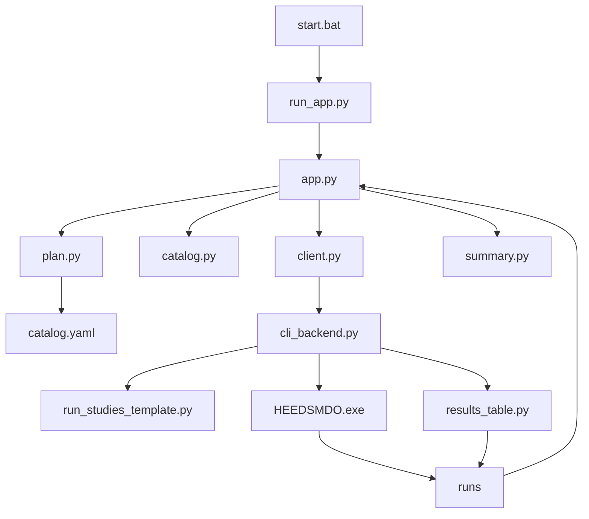

# ファイルの関連（初学者向け）

この文書では、「起動してから結果が出るまで、どのファイルがどのファイルを呼ぶか」を説明します。

全体像は [01_はじめに.md](01_はじめに.md)、設定値は [03_変数と設定.md](03_変数と設定.md) です。1通ごとの入出力は [09_起動から終了までの流れ.md](09_起動から終了までの流れ.md) です。

## 呼び出しの流れ（図）



言葉で言うと次です。

1. `start.bat` または `run_app.py` でチャットサーバーを起動する
2. `app.py` がブラウザの入力を受け取る
3. `plan.py` がカタログを見て、文に含まれる要件と、実行する試験 ID を決める。確認文もここで作る
4. 同意のあと、`client.py` → `cli_backend.py` が HEEDS 用スクリプトを作り、`HEEDSMDO.exe` を起動する
5. `results_table.py` が入力水準ごとの横断表を作り、結果が `runs/` に保存され、`app.py` が表やファイルとしてチャットに出す
6. `summary.py` が、その結果 JSON を Azure OpenAI に渡して短い日本語にする。試験の選び直しはしない

## フォルダの見取り図

```text
20261002_HEEDS-Chat-SameLevels/
├── start.bat              … ダブルクリック起動
├── check_heeds.bat        … プログラム設定と HEEDS 実名のチェック（解析しない）
├── check_heeds_project.py … 名前チェックの入口
├── run_app.py             … 推奨の起動入口
├── app.py                 … チャット画面。要件と CSV の振り分け
├── chainlit.md            … 起動時にカタログから作る説明文（手で編集しない）
├── sample.csv             … 変数の記入例（チャットからダウンロードする）
├── requirements.txt       … 入れるライブラリ一覧
├── .env.example           … 設定の雛形（これをコピーして .env を作る）
├── .env                   … 実際のキー・パス（自分で作る。Git に上げない）
├── .chainlit/             … Chainlit の画面設定
├── public/                … CSS など見た目
├── tests/                 … カタログから確認文が作られることのテスト（HEEDS は使わない）
├── heeds/                 … HEEDS 連携の本体
│   ├── catalog.yaml       … 言葉と試験の唯一の定義
│   ├── catalog.py         … YAML の読み込みと、開始文の組み立て
│   ├── plan.py            … 文から要件を決め、確認文を作る
│   ├── shared_levels.py   … CSV から全試験共通の水準表を作る
│   ├── summary.py         … 実行後の要約だけ AI に書かせる
│   ├── client.py
│   ├── cli_backend.py
│   ├── project_check.py   … 名前の事前チェック
│   ├── results_table.py   … 共通水準ごとの横断表
│   ├── welcome.py         … chainlit.md の生成
│   └── scripts/
│       ├── run_studies_template.py
│       └── check_project_template.py
├── HEEDS_PROJECT/         … 使う .heeds ファイルの置き場（別の場所でもよい）
├── runs/                  … 実行結果の保存先
└── docs/                  … この説明書たち
```

## ファイル一覧（役割・編集・関連）

| ファイル | 役割 | 初学者が編集するか | 主に関連する先 |
| --- | --- | --- | --- |
| `start.bat` | `.venv` と `.env` を確認してから `run_app.py` を起動 | 通常はしない | `run_app.py` |
| `check_heeds.bat` | プログラム設定と HEEDS 実名の突き合わせを起動 | **チャットの前に実行してよい** | `check_heeds_project.py` |
| `check_heeds_project.py` | `catalog.yaml` と HEEDS の Study・変数・出力名を比較 | **チャットの前に実行してよい** | `heeds/project_check.py` |
| `run_app.py` | Python 3.12 向けに Chainlit を起動 | 通常はしない | `app.py`, `heeds/welcome.py` |
| `app.py` | チャット UI。メッセージの振り分け、結果の表・添付 | 通常はしない | `heeds/plan.py`, `heeds/client.py` |
| `heeds/plan.py` | 言葉から試験 ID を決め、確認文を作る。同意の短文かも判定する | 通常はしない | `catalog.yaml`, `shared_levels.py` |
| `heeds/shared_levels.py` | CSV の刻みから、全試験で同じ水準表を作る | 通常はしない | `plan.py`, `cli_backend.py`, `results_table.py` |
| `heeds/summary.py` | 実行結果の日本語要約 | 通常はしない | Azure OpenAI |
| `chainlit.md` | チャット開始時に出る説明 | **しない**（生成物） | `heeds/welcome.py` |
| `requirements.txt` | `pip install` するライブラリ名 | 通常はしない | セットアップ時に使う |
| `.env.example` | `.env` の雛形 | コピー元として使う | [03_変数と設定.md](03_変数と設定.md) |
| `.env` | API キー・HEEDS のパス。Study 名の上書きは任意 | **必須で書く** | `cli_backend.py`, `summary.py` |
| `.chainlit/config.toml` | Chainlit の表示設定 | 慣れないうちはしない | `app.py` |
| `public/custom.css` | チャット幅などの見た目 | 任意 | Chainlit 画面 |
| `heeds/catalog.yaml` | 受け付ける要件、試験、HEEDS 画面の Study 名の既定 | **言葉や試験を変えるときはここ** | `catalog.py`, `plan.py` |
| `heeds/catalog.py` | YAML を読み、開始文や試験名の解決をする | 通常はしない | `catalog.yaml` |
| `heeds/client.py` | 「HEEDS を実行して」の窓口 | 通常はしない | `cli_backend.py` |
| `heeds/cli_backend.py` | スクリプト生成と `HEEDSMDO.exe -b` の起動 | 通常はしない | `scripts/`, `results_table.py`, `runs/` |
| `heeds/project_check.py` | プログラム設定と HEEDS 実名を解析なしで比較 | 通常はしない（入口は `check_heeds_project.py`） | `catalog.yaml` |
| `heeds/scripts/check_project_template.py` | 名前検査用の HEEDS 内スクリプト | 通常はしない | `project_check.py` が埋めて使う |
| `heeds/results_table.py` | 試験結果を共通水準の行へ横断結合する | 通常はしない | `cli_backend.py`, `app.py` |
| `heeds/scripts/run_studies_template.py` | HEEDS **の中で**動く公式 API 用テンプレ | 通常はしない | `cli_backend.py` が埋めて使う |
| `heeds/welcome.py` | `chainlit.md` をカタログから書き出す | 通常はしない | `catalog.yaml` |
| `heeds/variable_csv.py` | 添付 CSV を変数のリストにする | 通常はしない | `app.py` |
| `HEEDS_PROJECT/` | 使う `.heeds` ファイルを置ける場所 | **ここに置いてよい**。別の場所でもよい | `.env` の `HEEDS_PROJECT_PATH` |
| `tests/test_catalog.py` | カタログを変えると確認文が追従することの確認 | 実行してよい。HEEDS は不要 | `catalog.py`, `plan.py` |
| `runs/` | 実行ごとの結果フォルダ | 中身は消してよい。手編集は不要 | `cli_backend.py`, `app.py` |

## 起動まわり（誰が最初か）

| 起動方法 | 実際に動くもの |
| --- | --- |
| `start.bat` をダブルクリック | 内部で `.\.venv\Scripts\python.exe run_app.py` |
| `check_heeds.bat` をダブルクリック | 内部で `.\.venv\Scripts\python.exe check_heeds_project.py`（解析しない） |
| `.\.venv\Scripts\python.exe run_app.py` | `run_app.py` → Chainlit → `app.py` |
| `chainlit run app.py` | **使わない**（環境によって画面が真っ白になることがある） |

## AI が触れる範囲

AI にツール（関数）は渡していません。試験 ID を AI に選ばせると、カタログと指示文の両方を直す必要があったためです。

| 場面 | 誰が決めるか | 中で使うもの |
| --- | --- | --- |
| どの試験を実行するか | プログラム（`plan.py`） | `catalog.yaml` の `label` / `aliases` / `study_ids` |
| 確認文の文面 | プログラム（`plan.py`） | カタログの日本語名と、CSV の各行 |
| 実行後の短い要約 | Azure OpenAI（`summary.py`） | 実行結果の JSON。数値の作り足しは指示で禁じている |
| HEEDS の起動 | プログラム（`cli_backend.py`） | 同意があったときだけ。渡す ID は直前の確認で示したもの |

実行してよい試験 ID は、カタログの `studies` に書いたものだけです。`cli_backend.py` が実行直前にもう一度ホワイトリストと突き合わせます。

## HEEDS 実行まわり（`cli_backend` 以降）

1. `cli_backend.py` が `runs/<時刻>/` を作る
2. `run_studies_template.py` にプロジェクトパス・スタディ名・変数を埋め込んだ一時スクリプトを書く
3. `HEEDSMDO.exe -b <project.heeds> <一時スクリプト>` を起動する
4. HEEDS 内で open → 変数設定 → 実行 → レポート出力 → 各デザインの入出力取得
5. `results_table.py` が `levels_summary.csv`（水準横断表）を作り、`app.py` がチャットへ添付する

Study の画面名は、まず `catalog.yaml` の `heeds_name` です。`.env` に `HEEDS_STUDY_<試験IDの大文字>` があるときだけ、そちらが優先されます。

手順の確認方法は [05_HEEDS接続.md](05_HEEDS接続.md) です。

## 編集するときの目安

| やりたいこと | 触る場所 |
| --- | --- |
| API キーや HEEDS のパスを入れる | `.env` |
| チャットの言葉を変える | `heeds/catalog.yaml` の `label` か `aliases`。起動し直す |
| ある要件が実行する試験を入れ替える | 同じファイルの `study_ids` |
| 試験を足す | HEEDS に Study を作り、`catalog.yaml` の `studies` と `design_requirements` に足す。手順は [08_試験の種類を変える.md](08_試験の種類を変える.md) |
| この PC だけ Study 名が違う | `.env` に `HEEDS_STUDY_*` を1行。無ければ `heeds_name` を使う |
| 記入例の変数名や範囲を変える | `sample.csv`（実行時に使う範囲は、アップロードした CSV） |
| 試験の出力列を変える | HEEDS の Response（`catalog.yaml` には書かない） |
| 名前が揃っているか確認する | `check_heeds_project.py` または `check_heeds.bat` |
| 開始画面の文章の型（表以外）を変える | `heeds/catalog.py` の `welcome_markdown`。表の中身はカタログから作るので、そこには書かない |

`catalog.yaml` を変えたあとは、チャットサーバーを**再起動**してください。開始文は新しいチャットを開くときに読み直しますが、入力欄の上の例はプロセス起動時のカタログのまま残ることがあります。

## 次に読むもの

- [03_変数と設定.md](03_変数と設定.md) … `.env` とカタログの各項目
- [04_SPEC.md](04_SPEC.md) … 入出力と成功の目安
- [05_HEEDS接続.md](05_HEEDS接続.md) … 実機のつなぎ方と確認手順
- [09_起動から終了までの流れ.md](09_起動から終了までの流れ.md) … ファイルごとの入力・処理・出力
