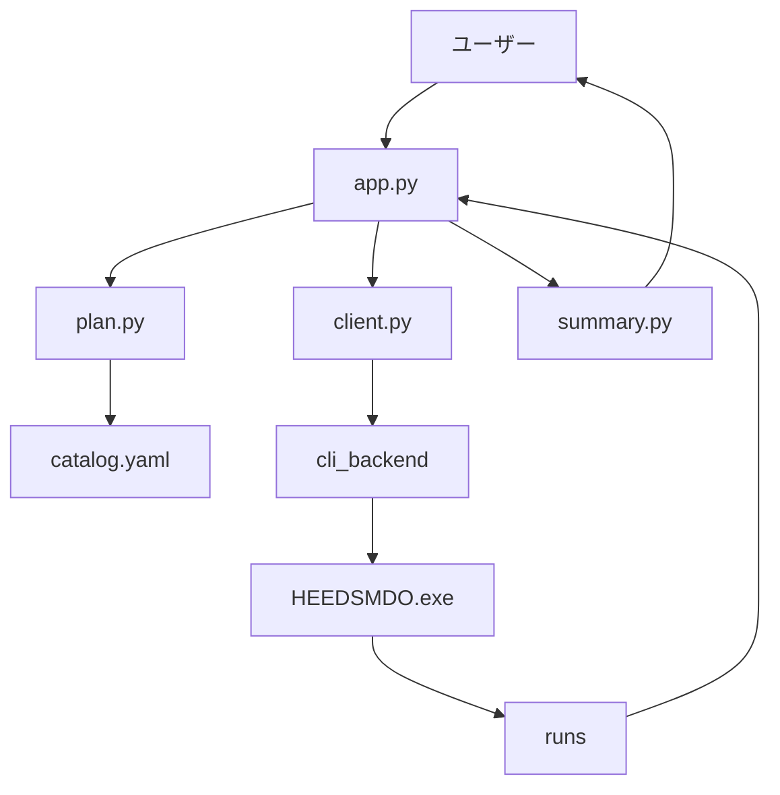
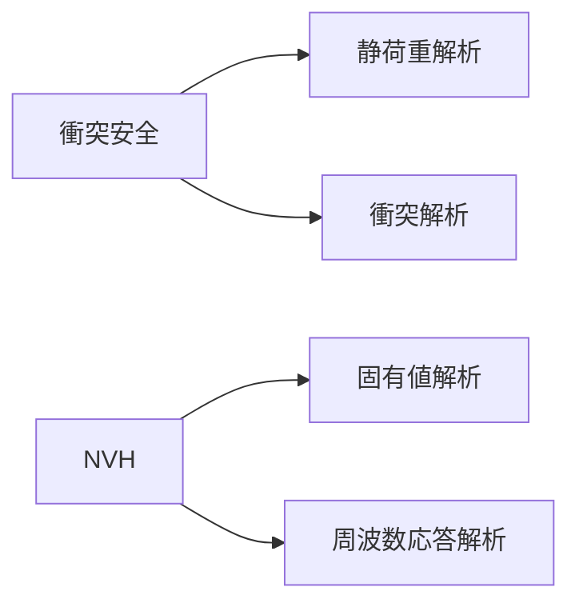
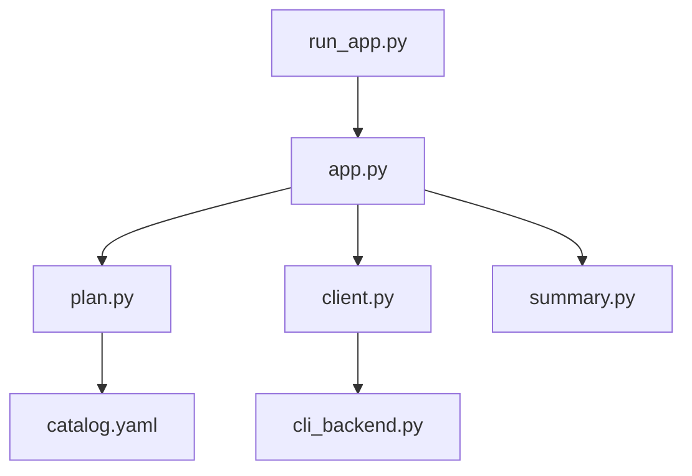
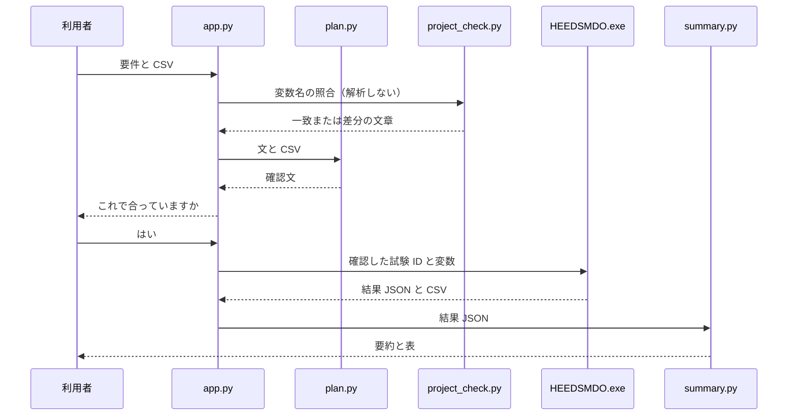

# 仕様書

セットアップは [セットアップ.md](セットアップ.md)、動かし方は [動かし方.md](動かし方.md)。HEEDS へのつなぎ方は [05_HEEDS接続.md](05_HEEDS接続.md)。プロジェクト作成時の名前の約束は [06_HEEDSファイルを作るとき.md](06_HEEDSファイルを作るとき.md)。設定名の突き合わせは [07_設定チェック.md](07_設定チェック.md)。言葉や試験の変え方は [08_試験の種類を変える.md](08_試験の種類を変える.md)。ファイルごとの入出力は [09_起動から終了までの流れ.md](09_起動から終了までの流れ.md)。

Python は **3.12**（`py -3.12 -m venv .venv` / `.\.venv\Scripts\python.exe`）。

**初学者の方へ:** 先に [01_はじめに.md](01_はじめに.md) → [02_ファイルの関連.md](02_ファイルの関連.md) → [03_変数と設定.md](03_変数と設定.md) を読んでから、この仕様書に進んでください。

この文書に出てくる「衝突安全」「NVH」は、同梱している `heeds/catalog.yaml` の初期値です。定義そのものはカタログです。

## 全体像

チャットに設計要件を書くと、カタログどおりの試験と、CSV の変数を確認したうえで、HEEDS スタディを公式 Python API（`HEEDSMDO.exe -b`）で実行し、結果を返します。同意があるまで HEEDS は動きません。試験 ID はプログラムが決め、AI は実行後の要約だけを書きます。

### 図1: リクエストの流れ



確認の段階では `Client` 以降には進みません。`Summary` は実行が戻ったあとにだけ動きます。

### 図2: 設計要件と試験の対応（同梱時）



### 図3: ソースファイルの依存



## 入出力

### 入力（チャットに書くもの）

| 項目 | 必須 | 内容 |
| --- | --- | --- |
| 設計要件 | はい | カタログの `label` または `aliases` が文に含まれること。同梱時は `衝突安全` / `NVH` と、その別名 |
| 入力変数 | はい | 記入した `sample.csv` を添付する。列は変数名・下限値・初期値・上限値・刻み。行数は可変 |

`sample.csv` の記入例:

| 変数名 | 下限値 | 初期値 | 上限値 | 刻み |
| --- | --- | --- | --- | --- |
| thickness | 1 | 2 | 3 | 0.5 |
| width | 40 | 50 | 60 | 10 |

| 設計要件（同梱時） | 実行する試験 |
| --- | --- |
| 衝突安全 | 静荷重解析（`stress`）と衝突解析（`crash`） |
| NVH | 固有値解析（`eigenvalue`）と周波数応答解析（`frf`） |

CSV と要件の両方が揃うまで、試験の確認や HEEDS の実行には進みません。CSV を受け取った直後は、解析せずにカタログ上の各 Study の AgentVariable と照合します。CSV にだけある名前、HEEDS にだけある名前、個数の違いをチャットに出します。

### 出力（HEEDS から取り、チャットに出すもの）

1. Azure が書けるときは、結果 JSON の短い日本語。書けないときは「結果は下の表です。」
2. 入力水準ごとの Markdown 表。チャット本文に載せるのは先頭 30 水準まで
3. 添付ファイル
   - `levels_summary.csv` … 上の表と同じ横断表
   - `{試験ID}_designs.csv` … 試験ごとのデザイン一覧。本文には先頭 8 行も出す
   - `{試験ID}_Report.txt` … HEEDS 内スクリプトが書いたレポート

表の列は、左から「水準」、CSV の変数名、実行した Study の Response 名です。同じ Response 名が複数試験にある場合、または入力列と同名の場合は、値を上書きしないよう `試験ID.Response名` にします。Response が取れないセルは「—」です。浮動小数は有効数字おおむね 6 桁で表示します。

数値そのものは HEEDS の解析結果です。行数は共通水準の件数で、番号もその表の順です。出力列の並びは、実行した試験の順で、Response が現れた順です。変数列は CSV の行順です。

### 例1: 開始時

開始メッセージは `catalog.yaml` から作った表と、`sample.csv` の添付です。同梱時の表は「衝突安全 → 静荷重解析、衝突解析」「NVH → 固有値解析、周波数応答解析」です。入力欄の上に、各 `label` のボタンが出ます。押すと「衝突安全を確認したい。」のような文が入ります。この時点では HEEDS は動きません。

### 例2: 要件だけ（CSV が無い）

利用者: `衝突安全を確認したい。`

プログラム: 変数の CSV がまだないこと、`sample.csv` を添付すること、両方揃うまで確認も実行もしないことを返します。試験の確認文は出しません。

### 例3: CSV だけ（要件が無い）

利用者: （記入済み CSV を添付。本文は空でもよい）

プログラム: 先に変数名を HEEDS と照合し、その文章を出します。続けて、何を確認したいかを、カタログの `label` を使った例文で聞きます。要件が無いので確認文には進みません。CSV の内容はセッションに残ります。

### 例4: 記入済み CSV と要件（名前が一致）

利用者: CSV を添付し、`衝突安全を確認したい。`

プログラムは照合文のあと、おおよそ次の確認文を出します。数値は CSV の行です。

```text
衝突安全として、次を実行する内容です。
試験: 静荷重解析（stress）、衝突解析（crash）

thickness: 下限 1、初期値 2、上限 3、刻み 0.5
width: 下限 40、初期値 50、上限 60、刻み 10

共通の水準は 15 件です。実行する試験は、すべてこの順と同じ入力です。
水準1: thickness 1、width 40
水準2: thickness 1、width 50
水準3: thickness 1、width 60
水準4: thickness 1.5、width 40
ほか 11 件は、同じ刻みの組み合わせで続きます。
範囲を変えるときは CSV を直して再アップロードしてください。
これで合っていますか？
```

水準の番号は CSV の行順の直積です。先頭の変数がいちばん遅く変わります。初期値が格子の上に無いときは、その値だけの水準は作りません。組み合わせが 200 件を超える CSV は、確認に進まず HEEDS も起動しません。

ここでは HEEDS の解析は走りません。変数名の照合のために HEEDS を開くことはあります（`runs/check_<時刻>/`）。

### 例5: 照合がずれたとき

照合文に「CSV にだけある」「HEEDS にだけある」と出ます。そのあとに確認文が続くことがあります。ずれたまま `はい` と返すと、実行段階でその Study は失敗します。先に CSV か HEEDS の AgentVariable を揃えて、CSV をアップロードし直してください。

### 例6: 同意したあと（衝突安全）

利用者: `はい`

プログラムは「HEEDS を実行しています…」と出してから、`stress` と `crash` を、確認文に出した共通水準のまま実行します。元の `.heeds` は変えず、同じフォルダの一時コピーで Study を EVAL にして走らせます。戻りは要約文、水準の表、CSV とレポートの添付です。成功すると、そのチャットの確認待ちは解除されます。失敗したときは表またはエラーが残り、同じ「はい」をもう一度送っても、確認待ちが解除されているため実行は再開しません。要件の言葉をもう一度送って、確認からやり直します。

### 例7: 同意したあと（NVH）

`NVHを確認したい。` の確認のあと `はい` とすると、`eigenvalue` と `frf` が走ります。表の出力列は、その2つの Study の Response です。

### 例8: 両方を一文で書く

`衝突安全とNVHを確認したい。` は、カタログの並びで両方の要件に一致します。確認文は要件ごとにブロックが続き、同意すると4試験が実行されます。時間と負荷が大きくなります。

## 処理の流れ



同意の判定、試験 ID、確認文は `plan.py` です。`summary.py` はこの図の最後だけにいます。

## 共通水準（総当たり）

水準の中身は、チャット実行の前にこのプログラムが決めます。HEEDS の SHERPA やラテンハイパーキューブでは決めません。

各変数を、CSV の下限から上限まで刻み幅で等間隔に切ります。水準は、その値のすべての組み合わせ（総当たり）です。変数の並びは CSV の行順で、先頭の変数がいちばん遅く変わります。`sample.csv` なら板厚は 1、1.5、2、2.5、3、幅は 40、50、60 なので 15 件です。水準1は板厚 1・幅 40、水準2は板厚 1・幅 50 です。初期値は、この格子の上にあるときだけ水準に入ります。格子の外の初期値だけの水準は作りません。この番号は CSV だけで決まるので、衝突安全と NVH を別々に実行しても、同じ CSV なら同じ番号は同じ入力です。組み合わせが 200 件を超える CSV は、確認に進まず HEEDS も起動しません。

元の `.heeds` の Study が SHERPA のままで構いません。実行時は元ファイルを変えず、同じフォルダに一時コピーを作り、コピー側の Study だけを `EVAL`（指定した設計だけを評価する種類）にします。共通の水準表をその Study にまとめて渡し、`run` をスタディごとに 1 回呼びます。HEEDS のプロセス起動は、同意 1 回につき 1 回です。水準ごとに `HEEDSMDO.exe` を起動し直すことはしません。1 回の `run` の中で、水準1、水準2、…と解析が進みます。次のスタディにも、同じ表を同じ順で渡します。

## HEEDS 実行の要点

- 起動コマンドは `HEEDSMDO.exe -b <一時コピー> <一時スクリプト>`
- 元の `.heeds` は変更しない。同じフォルダに `*_chat_<時刻>.heeds` を作り、そのコピーを開く
- 一時スクリプトは `heeds/scripts/run_studies_template.py` に値を埋めたもので、`runs/<時刻>/run_studies_heeds.py` に残る
- `import HEEDS` は、この一時スクリプトの中だけで使う。ホストの Python では失敗するのが正常
- CSV の下限・刻み・上限から共通の水準表を1つ作る。実行する Study はすべて、その表を同じ順で評価する
- コピー側の Study は `EVAL` にし、UserDesignSet に水準を書く。各設計の `map` は false で、Study 側の分割へ吸い寄せない
- 変数の min / baseline / max / resolution もセットし、指定値が範囲の外にならないようにする
- 実行は `run(results="reuse", wait=True)`。状態が `completed` でなければ追加で待つ
- 結果表の水準番号は、実行後に並べ直さず、実行前の共通表の番号のまま
- ホワイトリスト外の試験 ID は、HEEDS を起動する前にエラーで返る
- 水準が 200 件を超えるときは、HEEDS を起動する前にエラーで返る

## 共通設定・スコープ外

やらないこと: 解析結果の合否判定、最適化の提案、チャットに書いた数値での範囲変更、AI による試験の選択、AI への任意コマンド、複数同時の HEEDS 起動、POST の Discover / Investigate。

会話の記憶は、そのブラウザのチャットセッションだけです。タブを閉じると、変数と要件は消えます。`runs/` のファイルは残ります。

## 既知の限界・不具合になりやすいケース

### 仕様上の限界

| 限界 | 説明 |
| --- | --- |
| 解析品質・合否判定はしない | 数値の取得と表表示まで |
| 会話履歴は永続しない | ブラウザのタブを閉じると、変数と要件は消える |
| 同時に複数 HEEDS は起動しない | 1回の同意につき 1 プロセス |
| 言い換えは別名だけ | カタログの `label` と `aliases` に無い言葉は、要件として扱わない |
| 短い別名は部分一致 | `衝突` は「衝突安全」にも含まれる |
| カタログの全 Study と CSV を照合する | 今回実行しない Study の変数違いも、アップロード時の照合文に出る |
| 要約は結果の説明だけ | 数値を作り足さないよう指示しているが、モデルが従わない可能性は残る。表の数値が正 |
| API キーが無くても確認と実行はできる | 要約だけ「結果は下の表です。」になる |
| カタログ変更後は再起動が確実 | 開始文は新しいチャットで読み直す。入力欄のボタンはプロセスを止めないと古いままのことがある |

### こうすると失敗・欠ける（設定・名前）

| ケース | 起きること | 対処 |
| --- | --- | --- |
| `heeds_name` と HEEDS 画面の Study 名が違う | Study が見つからず失敗 | 画面名に合わせる。この PC だけなら `.env` の `HEEDS_STUDY_*` |
| AgentVariable が CSV の変数名と違う | `Variable not found` | 綴りを揃える。大文字小文字も別物 |
| `.env.example` だけ編集して `.env` が無い | パスが読めず実行できない | `copy .env.example .env` |
| ホスト Python で `import HEEDS` | 必ず失敗する | 正常。`HEEDSMDO.exe -b` の中だけで使う |
| `study_ids` に未定義の ID | カタログ読み込みでエラー | `studies` にその ID を足す |
| 水準が 200 件を超える | 確認に進まず、HEEDS も起動しない | 刻みを粗くするか、変数を減らして CSV を添付し直す |

### こうすると結果が期待と違う

| ケース | 起きること | 対処・理解 |
| --- | --- | --- |
| 予定に無い入力が返る | その行は横断表に足さない。注意文が出て、水準番号は動かない | `runs/.../heeds_summary.json` の `designs` と、確認文の水準を見比べる |
| デザイン一覧が取れない | 共通水準の行は残り、出力だけ「—」になることがある | `runs/.../heeds_summary.json` の `designs` 件数を見る |
| 解析がタイムアウト | エラー。`HEEDS_TIMEOUT_SEC` を超えた | `.env` の秒数を延ばす |
| 衝突安全と NVH を一文で両方書く | 同梱時は 4 試験すべて実行 | 分けて送る方が安全なことが多い |
| 確認のあとに「はい、衝突で」と送る | 同意にならない | 実行するなら `はい` だけにする |
| 失敗のあとに「はい」だけ送る | 再実行されない | 要件の言葉をもう一度送り、確認からやり直す |

### 開発時の注意

| ケース | 起きること |
| --- | --- |
| `chainlit.md` を手で直す | 次にチャットを開くとカタログから上書きされる |
| `catalog.yaml` に出力名を書いても HEEDS は変わらない | 表は Response 名が基本。同名衝突時だけ `試験ID.Response名` |
| テンプレートを直接実行する | ホスト Python では `import HEEDS` に失敗する。本番は `cli_backend.py` が埋めたコピーを使う |
| 確認文の型を変えたい | `heeds/plan.py` の `confirmation_message`。試験の対応はここに書かない |

## 成功の目安

- 「衝突安全」→ 確認文に静荷重と衝突が出て、同意のあと両方が走る
- 「NVH」→ 確認文に固有値と周波数応答が出て、同意のあと両方が走る
- 同意の前に解析用の HEEDS 実行は走らない（名前照合のための起動は、CSV を受け取ったときに起きうる）
- 変数は CSV の行だけを使う。チャット本文の数値では範囲を変えない
- 結果の表と、`runs/<時刻>/` の `heeds_summary.json` / `levels_summary.csv` が残る
