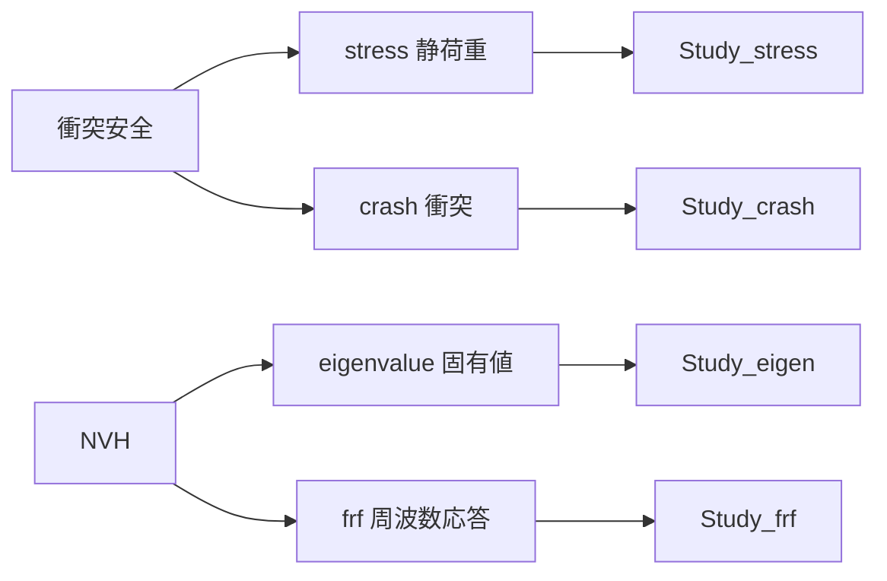
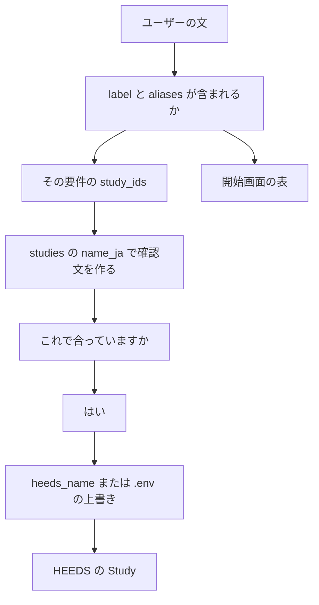

# 試験の種類を変える

この文書は、チャットに書く要件と、そのとき実行する解析を増やす・入れ替える手順です。

HEEDS のファイル名や変数名の約束は [06_HEEDSファイルを作るとき.md](06_HEEDSファイルを作るとき.md) です。項目の意味は [03_変数と設定.md](03_変数と設定.md) です。

編集するのは **`heeds/catalog.yaml` だけ**です。開始画面の表、入力欄の例、確認文、実行する試験 ID は、起動のたびにこのファイルから作ります。`app.py` や AI への指示文へ、同じ対応を書き写す手順はありません。

直したあとはチャットを再起動し、`check_heeds_project.py` を実行します。

## 2つの層

同梱時の対応は次です。左がチャットの言葉、真ん中が試験 ID、右が HEEDS 画面の Study 名（カタログの `heeds_name`）です。言葉を変えたあとは、この図ではなく YAML の中身が正です。



| 層 | 同梱時の例 | 決まること | 書く場所 |
| --- | --- | --- | --- |
| チャットの言葉 | 衝突安全、NVH | ユーザーが何と書くか | `design_requirements` の `label` と `aliases` |
| 解析（Study） | `stress`、`crash`、`eigenvalue`、`frf` | その言葉で、どの試験 ID を実行するか | 同じ要件の `study_ids` |
| 画面の Study 名 | `Study_stress` など | HEEDS のどの Study を開くか | `studies` の `heeds_name` |

1つの要件は、`study_ids` に書いた試験を欠けなく、書いた順に実行します。個数は2個固定ではありません。

## ユーザーの文が通る経路

上から順に、カタログの1か所が違うと、意図した試験になりません。経路の途中に、手書きの対応表はもうありません。



| 変えたいこと | 触る場所 |
| --- | --- |
| 言い方だけ | その要件の `label` または `aliases` |
| 実行する解析の入れ替え | その要件の `study_ids` |
| 解析を足す | HEEDS の Study と、`studies` と `design_requirements` |
| この PC だけ画面名が違う | `.env` に1行。カタログは共有の既定のままにできる |

## 言い方だけ変える

解析の中身はそのまま、チャットの言葉だけ変えるときです。例: 「衝突安全」を「衝突性能」にする、「剛性」を衝突安全の別名にする。

1. `heeds/catalog.yaml` の対象要件で、`label` または `aliases` を直す
2. 動いているチャットを止め、[動かし方.md](動かし方.md) のとおり起動し直す
3. 開始画面の表と、入力欄の上のボタンが新しい言葉になっているか見る

試験 ID、`heeds_name`、`.env`、HEEDS の Study は触りません。

短い語（例: `衝突`）は、長い言葉（衝突安全）にも含まれます。意図しない文章で要件ありと判定されないように、語を選びます。

## ある要件が実行する解析を入れ替える

例: 衝突安全を衝突解析だけにする。静荷重を外し、別の解析を足す。

足す試験 ID が、まだ `studies` に無いときは、先に [解析を足す](#解析を足す) を済ませます。すでにある ID の入れ替えなら、次だけで足ります。

1. その要件の `study_ids` を、実行したい ID だけにする。確認文と表の列の並びに近いので、出したい順に書く
2. チャットを起動し直す
3. その言葉を送った確認文の「試験:」が、意図した日本語名と ID になっているか見る

外しただけの Study は HEEDS に残して構いません。設定チェックでは「プログラムが使わない Study」と出ます。カタログの `studies` に ID が残っているあいだは、チェックはその Study も見ます。チェック対象からも外すなら、`studies` からその ID を削除し、どの要件の `study_ids` にも残っていないことを確認します。

## 解析を足す

例: 耐久 `fatigue` を足し、「耐久を確認したい」でそれだけ実行する。

### HEEDS

1. プロジェクトに Study を作る。画面の Study 名は自由（例: `Study_fatigue`）
2. チャットで使う CSV の変数名と同じ AgentVariable を、その Study に作る
3. 見たい結果を Response にする。名前が、実行後の表の見出しになる

作り方の細部は [06_HEEDSファイルを作るとき.md](06_HEEDSファイルを作るとき.md) です。

### カタログ

1. `studies` に足す。`heeds_name` は、いま作った画面の Study 名と一字一句同じにします。

```yaml
  - id: fatigue
    name_ja: 耐久解析
    description: 耐久の応答を見る試験です。
    heeds_name: Study_fatigue
```

2. `design_requirements` に、チャットの言葉を足す。既存の要件の `study_ids` に `fatigue` を足すだけでもよい。

```yaml
  - id: durability
    label: 耐久
    aliases:
      - 疲労
    study_ids:
      - fatigue
    summary: 耐久解析を実行します。
```

`study_ids` に書いた ID が `studies` に無いと、カタログを読んだ時点でエラーになり、その先へ進みません。`heeds_name` や `name_ja` が空でも同じです。

この PC の Study 名だけ、共有のカタログと違うときは、`.env` に次の1行を足します。無ければ `heeds_name` を使います。

```text
HEEDS_STUDY_FATIGUE=実際のStudy名
```

左側は `HEEDS_STUDY_` に、試験 ID を大文字にしたものを続けます。Python のファイルへこの行を登録する作業はありません。

日本語名だけ変える（静荷重解析 → 静的強度）ときは、`studies` の `name_ja` だけを直します。試験 ID と `heeds_name` はそのままです。

## 変えたあと

1. 動いているチャットを止め、[動かし方.md](動かし方.md) のとおり起動し直す
2. 次で Study 名を確認する。変数も見るときは CSV を付ける

```powershell
.\.venv\Scripts\python.exe check_heeds_project.py
```

3. チャットに新しい言葉と CSV を送り、確認文の試験名が意図どおりか見る。違うときは `はい` と返さず、`study_ids` を見直す
4. HEEDS を動かさずに言葉だけ確認したいときは、`tests/test_catalog.py` が同じ仕組みを検査しています。プロジェクト直下で次を実行します

```powershell
.\.venv\Scripts\python.exe -m unittest tests.test_catalog
```

## 関連ドキュメント

- [03_変数と設定.md](03_変数と設定.md) … `design_requirements` と `studies` の項目
- [06_HEEDSファイルを作るとき.md](06_HEEDSファイルを作るとき.md) … HEEDS 側の Study・変数・Response
- [07_設定チェック.md](07_設定チェック.md) … 直したあとの名前確認
- [09_起動から終了までの流れ.md](09_起動から終了までの流れ.md) … 確認文がどの関数で作られるか
