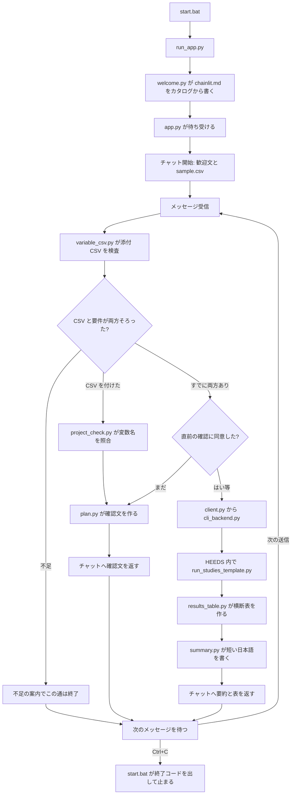

# 起動から終了までの流れ

`start.bat` を起動してから、チャットが1通ずつ処理され、最後にウィンドウで Ctrl+C してプログラムが止まるまでを、動く順番で説明します。

各箇所は次の3つに分けて書いています。

- **入力** … そのファイルが受け取るもの
- **処理** … その中で行うこと
- **出力** … 次へ渡すもの、画面に出すもの、ディスクに残すもの

全体像は [01_はじめに.md](01_はじめに.md)、ファイルの役割一覧は [02_ファイルの関連.md](02_ファイルの関連.md)、設定項目の意味は [03_変数と設定.md](03_変数と設定.md) です。AI がどこでだけ動くかは、この文書の「AI が書くもの」にまとめてあります。

## 全体の流れ

ブラウザを開いているあいだ、サーバーは待ち続けます。1通のメッセージは「CSV と要件がそろっているか」で分岐し、HEEDS の解析が走るのは、確認文へ「はい」などと同意したときだけです。

計算そのものは HEEDS が行います。この Python プログラムは、チャットの文章をカタログの試験 ID に変え、同意のあと HEEDS を起動し、返ってきた数値を表にしてチャットへ戻します。

## AI が書くもの

試験の選択に、AI は使いません。以前の形では、同じ対応表をカタログと、AI への指示文の両方に書いていました。片方だけ直すと、画面と実行がずれました。今は `heeds/catalog.yaml` だけが定義で、`heeds/plan.py` が文字列の包含で要件を決め、確認文も Python が組み立てます。

AI が動くのは、同意して HEEDS が戻ったあとです。`heeds/summary.py` が結果の JSON を Azure OpenAI に1回渡し、短い日本語にします。ツール（関数）の呼び出しはさせません。試験の選び直しもさせません。数値を作り足さないよう指示しています。表のセルは、この要約とは別に `app.py` が JSON から作ります。表の方が数値の正です。

| ライブラリ | このプログラムでの役割 |
| --- | --- |
| `chainlit` | ブラウザのチャット。`app.py` の `on_chat_start` と `on_message` を呼ぶ |
| `pyyaml` | `catalog.yaml` を辞書にする |
| `python-dotenv` | `.env` をプロセスの環境変数にする |
| `langchain-openai` | 要約の1回だけ、Azure OpenAI へ HTTP で話す `AzureChatOpenAI` |
| `langchain-core` | 要約に渡す `SystemMessage` と `HumanMessage` の型 |

`langgraph` も、ツール付きのエージェントも、このリポジトリでは使いません。グラフの往復はありません。

要約が失敗しても、HEEDS の結果は残ります。キーが空、`LLM_PROVIDER` が `azure` 以外、通信エラー、ライブラリが無い、のいずれでも、定型の「結果は下の表です。」に落ちます。確認文の段階では Azure を呼びません。

モデルの設定は `.env` です。デプロイ名が空なら `gpt-4o`、API 版が空なら `2024-10-21`、`temperature` は 0 です。渡す内容は、システム指示と、結果 JSON の2メッセージだけです。チャットのこれまでの文面は渡しません。

## 起動して待ち受けるまで

### `start.bat`

**入力**

エクスプローラからのダブルクリック、またはコマンドからの実行です。バッチは自分の場所へ移動したあと、同じフォルダに `.venv\Scripts\python.exe` があるか、`.env` があるかを見ます。中身の正しさまでは読みません。

**処理**

仮想環境の Python が無いときは、`py -3.12 -m venv .venv` と `pip install -r requirements.txt` を行うよう表示し、キー入力を待って終了コード 1 で終わります。`.env` が無いときは、`copy .env.example .env` して `HEEDS_EXE` と `HEEDS_PROJECT_PATH` を書くよう表示し、同じく終了します。Azure OpenAI の設定は結果要約だけに使う任意項目です。両方あるときは「Starting...」と `http://localhost:8000` を表示し、その Python で `run_app.py` を起動します。ここから先、バッチのウィンドウは Python が終わるまで占有されます。停止は、そのウィンドウでの Ctrl+C です。

**出力**

成功時は、動き続けるチャットサーバーのプロセスです。Python が終わると終了コードを受け取り、0 以外ならその値を表示します。最後に `pause` でキー入力を待ち、同じ終了コードでバッチも終わります。ブラウザを閉じただけでは、このプロセスは止まりません。

### `run_app.py`

**入力**

`start.bat` が起動した Python と、プロジェクト直下の `app.py` です。Chainlit の公式起動 `chainlit run app.py` は使いません。

**処理**

動いている Python の版が 3.12 でなければ、警告を標準エラーへ出して続行します。続けて `nest_asyncio.apply` を何もしない関数に差し替えます。この差し替えが無い環境では、Chainlit の画面が真っ白になることがあるためです。`.env` を読み、`heeds.welcome.publish_welcome()` で `chainlit.md` をカタログから書いたあと、Chainlit の `run_chainlit("app.py")` で画面プロセスを起動します。

**出力**

`app.py` を読み込んだ Chainlit サーバーです。ブラウザのアドレスは `http://localhost:8000` です。Chainlit はあわせて `.chainlit/config.toml`（画面設定）と `public/custom.css`（幅などの見た目）を読みます。

### `heeds/welcome.py`（起動時と、チャット開始時）

**入力**

`heeds/catalog.py` の `welcome_markdown()` が返す文字列です。中身は `catalog.yaml` の `design_requirements` と、各試験の `name_ja` から作った表です。`chainlit_ja.md` のような `chainlit_*.md` が残っていれば、それも見ます。

**処理**

`chainlit.md` を、その文字列で上書きします。`chainlit_*.md` は削除します。Chainlit の内部関数は差し替えません。`run_app.py`、`app.py` の読み込み時、そして新しいチャットの `on_chat_start` から呼ばれます。

**出力**

生成された `chainlit.md` と、チャット開始メッセージに使う同じ本文です。手で `chainlit.md` を編集しても、次にチャットを開くと上書きされます。文言の型（表の前後の説明）を変えるときは `welcome_markdown`、表の中身を変えるときは `catalog.yaml` です。

### `app.py`（プロセス起動時）

**入力**

`.env` と `catalog.yaml` です。`load_dotenv()` のあと `publish_welcome()` を呼びます。エージェントは作りません。

**処理**

モジュールを読み終えると、Chainlit がブラウザからの接続を `on_chat_start` と `on_message` へ振ります。入力欄の上のボタンは `set_starters` が、カタログの各 `label` から作ります。同梱時は「衝突安全」と「NVH」です。ボタンの送信文は「そのラベルを確認したい。」です。

**出力**

待ち受け状態です。Azure への接続はこの時点ではまだ張りません。

### チャット開始（`app.py` の `on_chat_start`）

**入力**

新しいチャットが開いたイベント、カタログ、`sample.csv` の有無です。`sample.csv` の場所は `variable_csv.sample_csv_path()` がプロジェクト直下として返します。

**処理**

そのチャットのセッションに、変数なし、要件 ID の空リスト、確認待ちなしを入れます。`publish_welcome()` で説明文を作り直し、同じ本文を最初のメッセージとして送ります。`sample.csv` があれば添付します。

**出力**

歓迎の本文と、ファイルがあれば `sample.csv` の添付です。例の中身は、列が「変数名, 下限値, 初期値, 上限値, 刻み」、行が `thickness` と `width` です。利用者はこのファイルをダウンロードし、行を書き換えて、あとからチャットへ添付します。サーバーは添付されたファイルを使い、配布用の `sample.csv` 自体は実行のたびに書き換えません。

## 1通のメッセージ

### `app.py` の `on_message`（振り分け）

**入力**

そのチャットのセッション（変数、要件 ID、確認待ち）と、今回の `cl.Message` です。メッセージは本文と、任意の添付ファイルを持ちます。これまでの全文は保存しません。要件 ID と変数だけを覚えています。

**処理**

最初に添付から CSV を探します。拡張子かファイル名が `.csv` のものを集め、次で止まります。

- エラーがある … 「変数 CSV を読めませんでした。」と理由を出して戻る
- CSV が無い … セッションに既にある変数をそのまま使う
- CSV が1つ読めた … セッションの変数をその内容で置き換え、確認待ちを解除する。前の「はい」は、新しい CSV には効かない

本文を `plan.match_requirements` に渡します。言葉が1つでも一致すれば、セッションの要件 ID を、その文に含まれた要件だけへ置き換えます。一致が無ければ、前の要件 ID を残します。一度「衝突安全」と言ったあとの「はい」が通るのは、この残りがあるからです。別の要件の言葉を送ると、前の要件は置き換わり、足されません。一文に両方の言葉があるときだけ、両方が入ります。

変数が無い、または要件 ID が空のときは、案内して戻ります。このとき CSV をちょうど受け取っていた場合だけ、案内の前に `compare_csv_with_heeds` で変数名を照合し、その文章を案内の先頭に付けます。案内は、CSV が無ければ `sample.csv` の添付を依頼し、要件が無ければカタログの `label` から作った例文を出します。

両方そろったあとの分岐は次です。

- 新しい CSV が無く、確認待ちで、`is_run_approval` が真 … HEEDS を実行する
- それ以外 … 確認文を出して、確認待ちを立てる

実行するときは「HEEDS を実行しています…」、確認のときは「確認内容をまとめています…」を一度出してから、同じ吹き出しを完成文へ更新します。CSV を受け取った通では、先に照合の吹き出しを出します。

**出力**

不足のときは案内メッセージだけで、この通は終わります。そろっているときは確認文か、実行結果です。セッションには変数、要件 ID、確認待ちの3つが残ります。

### `heeds/variable_csv.py`

**入力**

添付 CSV のファイルパスです。バイト列として読み、UTF-8（BOM 付きを含む）か CP932 で文字にします。どの符号化でも読めなければエラーです。

**処理**

1行目を列名として見ます。日本語（変数名、下限値、初期値、上限値、刻み）と英語（name、lower、baseline、upper、step など）の両方を、内部の名前に対応づけます。必須列が欠けていれば、足りない列名を日本語で返します。

2行目以降は、空行を飛ばし、1行を1変数にします。変数名が空、重複、数値が読めない、上限が下限より小さい、初期値が範囲の外、刻みが 0 以下、のいずれかがあれば、行番号付きのエラーを集めます。エラーが1つでもあるときは変数リストを空にして返します。一部だけ採用することはしません。行が1つも無くエラーも無いときは、「振る変数の行がありません。」とします。

**出力**

成功時は、変数の辞書のリストです。各辞書は `name`、`lower`、`baseline`、`upper`、`step` を持ちます。行数は固定せず、`width2` のような追加行もそのまま残します。失敗時は空リストとエラー文です。

### `heeds/plan.py`

**入力**

利用者の本文、セッションに残っている要件 ID、アップロード済みの変数、そして `catalog.yaml` を `catalog.py` 経由で読んだ辞書です。

**処理**

`match_requirements` は、各要件の `label` と `aliases` について、小文字化した文にその文字列が含まれるかを見ます。含まれる要件を、カタログの並びで返します。`study_ids_for` は、その要件の `study_ids` を順に並べ、重複を除きます。

`confirmation_message` は、要件ごとに「このラベルとして、次を実行する内容です。」と、日本語名（試験 ID）の列を書きます。続けて変数ごとに下限・初期値・上限・刻みを書き、共通水準の件数と先頭の数行を書きます。CSV を直すときは再アップロードする、と添えます。最後は必ず「これで合っていますか？」です。整数に見える数値は、小数点を付けません。水準が 200 件を超えるときは確認文を出さず、同意待ちにもしません。

`is_run_approval` は、空白と句読点を除いた文が、登録済みの同意の短文そのものと一致するかを見ます。説明を付けた文や、変数の語、取りやめの語、カタログの言葉が含まれる文は偽です。一覧は [03_変数と設定.md](03_変数と設定.md) の「同意」です。

**出力**

確認の通では、チャットに出す日本語の文字列です。実行の通では、`run_studies` に渡す試験 ID のリストです。AI はこの関数を通りません。

### `heeds/catalog.py` と `heeds/catalog.yaml`

**入力**

`heeds/catalog.yaml` です。`design_requirements` に要件と別名、対応する試験 ID があり、`studies` に実行してよい ID、日本語名、説明、画面の Study 名（`heeds_name`）があります。変数の範囲と Response 名は、このファイルには書いてありません。

**処理**

`load_catalog` は読むたびに YAML を開き、ID の重複、空の名前、`study_ids` が `studies` に無いこと、を検査します。キャッシュはしません。`heeds_study_name` は、環境変数 `HEEDS_STUDY_` に ID を大文字にしたものを先に見ます。値が無ければ `heeds_name` を返します。`welcome_markdown` と `starter_examples` は、開始画面とボタンの材料です。

**出力**

検証済みの辞書と、画面名の文字列です。`catalog.yaml` を変えたあとは、チャットサーバーを再起動します。開始文は新しいチャットでも読み直しますが、入力欄のボタンはプロセス起動時のまま残ることがあります。変え方は [08_試験の種類を変える.md](08_試験の種類を変える.md) です。

### `heeds/project_check.py`（CSV を送ったとき）

**入力**

CSV から得た変数名のリストです。あわせて `.env` の `HEEDS_EXE`、`HEEDS_PROJECT_PATH` と、カタログの各試験の画面名を見ます。経路は `app.py` の `compare_csv_with_heeds` です。

**処理**

まずホスト側だけで、実行ファイルとプロジェクトファイルが存在するか、各試験の画面名が空でないかを見ます。欠けるものがあれば、HEEDS は開かず、その理由の文章を返します。

通るときは `runs/check_<UTC時刻>/` を作り、`check_project_template.py` のプレースホルダへ、プロジェクトパス、出力先、試験 ID と画面名、照合する変数名を埋め込んだ一時スクリプトを書きます。起動コマンドは次です。

`HEEDSMDO.exe -b <プロジェクト.heeds> <一時スクリプト>`

待ち時間は 180 秒です。一時スクリプトは HEEDS の Python の中で動き、プロジェクトを開き、各 Study の AgentVariable 名と AgentResponse 名を読みます。Study の `run` は呼びません。標準出力と標準エラーは `heeds_stdout.txt` と `heeds_stderr.txt` に残します。

比べる Study は、カタログに書いてあるもの全部です。今回の要件が使わない Study も含まれます。

**出力**

チャットに載せる照合の文章です。CSV の個数と名前を示したあと、試験ごとに「一致」か、CSV にだけある名前と HEEDS にだけある名前かを書きます。全部一致していれば、その旨で結びます。ずれていても、この関数はチャットをそこで止めません。文章は案内または確認文の前に付き、続けて確認文へ進みます。

チャットの前に行う一括チェック（`check_heeds.bat`）も同じモジュールを使います。手順は [07_設定チェック.md](07_設定チェック.md) です。

## 同意したあとの HEEDS 実行

### `heeds/client.py`

**入力**

`app.py` が渡す試験 ID のリストと、変数の辞書リストです。

**処理**

中身の分岐は持たず、`run_cli_studies` を呼ぶだけです。画面が HEEDS の起動コマンドを直接組まないための窓口です。

**出力**

`cli_backend.py` が返す結果の辞書です。

### `heeds/cli_backend.py`

**入力**

試験 ID、変数、環境変数（`HEEDS_EXE`、`HEEDS_PROJECT_PATH`、任意の `HEEDS_STUDY_*`、`HEEDS_TIMEOUT_SEC`）と、カタログの `heeds_name` です。

**処理**

先に検査します。ID が空、カタログに無い、変数が無い、変数名が英数字と `_` 以外、数値が範囲外、水準の組み合わせが 200 件を超える、実行ファイルやプロジェクトファイルが無い、待ち時間が正の整数でない、のいずれかがあれば、`ok: false` と `errors` を返して HEEDS は起動しません。

通るときは、重複を除いた ID を画面名へ変換します。名前が空の ID があれば、そこでエラーを返します。時刻は UTC の `YYYYmmddTHHMMSSffffffZ`（マイクロ秒まで）で、`runs/<時刻>/` を作ります。同じ秒に複数回処理しても、同じフォルダを使わないためです。元の `.heeds` は同じフォルダに `*_chat_<時刻>.heeds` としてコピーし、そのコピーを開きます。`run_studies_template.py` の先頭コメントを除いた本文へ、コピーのパス、出力フォルダ、試験の ID と HEEDS 名、変数 JSON、共通水準 JSON を埋め、`run_studies_heeds.py` として保存します。起動したコマンド文字列は `command.txt` に残します。

`subprocess.run` で `HEEDSMDO.exe -b` を待ちます。見つからなければパスのエラー、時間を超せばタイムアウトのエラーです。終わったら標準出力と標準エラーをテキストで保存し、`heeds_summary.json` を読みます。JSON が無いときは、終了コードとともにその旨を返します。

JSON が読めたときは、試験ごとにレポートを実行フォルダへ集め、各デザインの入力と Response を `{試験ID}_designs.csv` に書きます。全試験を、実行前の共通水準の順で `build_levels_table` が横断し、`levels_summary.csv` を先頭の添付として並べます。`ok` は、JSON の `ok` が真であり、プロセスの終了コードが 0 であり、エラー配列が空であることです。

**出力**

結果辞書です。主なキーは `ok`、`backend`（`cli`）、`variables`、`studies`、`levels_table`、`csv_paths`、`file_paths`、`run_dir`、`project_path`、`project_copy`、`returncode` です。失敗時は `errors`、予定外の入力があれば `warnings`、成功時は実行方法の `note` が付きます。ディスク上には、一時スクリプト、コマンド、ログ、サマリ JSON、試験ごとの CSV とレポート、横断 CSV が `runs/<時刻>/` に残ります。一時コピーの `.heeds` は、元プロジェクトと同じフォルダに残ります。

### `heeds/scripts/run_studies_template.py`（HEEDS の中）

**入力**

`cli_backend.py` が埋め込んだプロジェクトのコピーのパス、出力フォルダ、試験一覧、変数一覧、共通水準です。このファイル自体をホストの Python で実行することはできません。`import HEEDS` は `HEEDSMDO.exe -b` の中だけで使えます。プレースホルダを埋めたコピーが、そのプロセスのスクリプトになります。

**処理**

出力フォルダを作り、`HEEDS.open` でプロジェクトを開きます。試験ごとに次を行います。

1. Study 名で `findChild` する。無ければその試験をエラーにして次へ進む
2. 現在の Study にし、CSV の各変数を `findVariable` で探す。1つでも無いとその試験は失敗する
3. `set` で min、baseline、max、resolution を入れる。resolution は `(上限-下限)/刻み + 1` を、2 以上に切り上げた整数です
4. Study を `EVAL` にし、同じ変数範囲をもう一度セットする。既存の UserDesignSet を空にして、共通水準を同じ順で追加する。各設計の `map` は false、`useResp` は false
5. `unlock` と `checkAndReport` のあと、`run(results="reuse", wait=True)` で完了まで待つ。状態が `completed` でなければ追加で `wait` する
6. `{試験ID}_Report.txt` を書く
7. 評価済みデザインの ID を集め、各 ID について入力変数と AgentResponse の値を読む。最良デザインの ID も取る

全試験が終わったら、成否、試験ごとのデザイン、エラーを `heeds_summary.json` に書きます。エラーがあった試験は JSON に残しつつ、最後に例外を上げます。ホスト側は終了コードと JSON の両方を見ます。

**出力**

`runs/<時刻>/heeds_summary.json` と、試験ごとの `*_Report.txt` です。デザインごとの数値はこの JSON の `designs` に入り、CSV への展開はホストの `cli_backend.py` が行います。

### `heeds/results_table.py`

**入力**

`cli_backend.py` が組み立てた試験ごとの結果（各デザインの `inputs` と `responses`）と、実行前の共通水準です。

**処理**

出力列は、HEEDS が返した Response 名を、現れた順に並べます。カタログでは列名を決めません。同じ Response 名が複数の試験にあるとき、または Response 名が `水準` や入力変数名と同じときは、値を上書きしないよう `試験ID.Response名` にします。行の単位は、共通水準の1件です。入力が一致した試験の Response を、その行へ横に足します。行番号は共通表の番号のままで、実行後に並べ直しません。予定に無い入力は行を増やさず、`unmatched` に残します。各行には、その組に対応した試験ごとの design ID も残します。

**出力**

`columns`、`rows`、`levels`、`unmatched` を持つ辞書です。`cli_backend.py` が `columns` と `rows` を結果の `levels_table` に入れ、同じ内容を `levels_summary.csv` に書きます。

### `heeds/summary.py`

**入力**

`cli_backend.py` が返した辞書を、JSON の文字列にしたものです。資格情報は `.env` です。

**処理**

`LLM_PROVIDER` が `azure` で、API キーがあり、ライブラリが読み込めるときだけ、`AzureChatOpenAI` を1回呼びます。システム指示は、渡された JSON だけを短く日本語にすること、数値を作り足さないこと、エラーがあれば伝えること、試験はすでに決まっているので選び直さないこと、です。それ以外の条件や、呼び出しの例外では、定型文を返します。

**出力**

チャット本文の先頭に置く文字列です。表はこの関数の出力には含めません。

## チャットへの返し

### `app.py`（実行のあと）

**入力**

`run_studies` の辞書、`summarize_result` の文字列、実行前に出していた「HEEDS を実行しています…」のメッセージです。

**処理**

要約を本文の先頭にします。`levels_table` があれば Markdown の表を続けます。チャット本文に載せるのは先頭 30 水準までで、超えた分は `levels_summary.csv` を見るよう1行足します。エラーと注意があれば表のあとに足します。数値の表示は、浮動小数なら有効数字おおむね6桁です。空の値は「—」です。

`csv_paths` の実在ファイルを添付します。`levels_summary.csv` は上の表と重複するので、本文への再掲はしません。それ以外の CSV（`stress_designs.csv` など）は、ファイル名を見出しに先頭8行の表も本文へ足します。`file_paths` のレポートも添付します。MIME が空だと Chainlit の画面が落ちるため、CSV は `text/csv`、テキストは `text/plain`、分からないものは `application/octet-stream` を付けます。

`ok` が真のときだけ、確認待ちを解除します。失敗のときは確認待ちを立てたままにはしません。同じ「はい」では再実行されないので、要件の言葉から確認をやり直します。

**出力**

同じ吹き出しを、完成した本文と添付へ更新したものです。利用者が次に送ると、また「1通のメッセージ」に戻ります。実行フォルダは消さず、`runs/` に残ります。

確認の通では、照合文があればそのあとに確認文を連結し、確認待ちを真にします。表や添付はありません。

## プログラムの終わり

**入力**

`start.bat` のウィンドウに対する Ctrl+C です。

**処理**

Chainlit のサーバーが止まり、`run_app.py` が終了します。`start.bat` は終了コードを受け取り、0 以外なら表示します。`pause` でキー入力を待ちます。

**出力**

バッチプロセスの終了です。`runs/` に残った実行結果と照合結果は、停止では削除しません。`chainlit.md` は、最後に生成した内容のままディスクに残ります。次の起動でまたカタログから書き直します。
